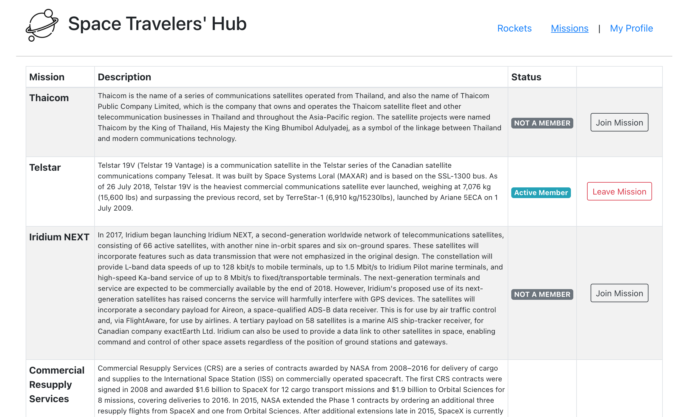

# SPACE TRAVELER'S HUB

> This project implements React and Redux to store info about rockets and space missions from Space X API, and let the user reserve a travel or a rocket.



Project created using `create-react-app` and implementing `react-redux` to retreive information from SpaceX API.

## Built With

- HTMl, CSS, JavaScript, React-Bootstrap.
- React.
- Redux.

## Live Demo

[Live Demo Link](https://maccrazyman.github.io/space-traveler-hub-react/)


## Getting Started

To get a local copy up and running follow these simple example steps.

### Prerequisites
* A functional computer with VS Code or any functional coding software.
* Git bash or any version control software.

### Setup
* Copy the repo link and clone it in your local machine
* You can execute the following command in your git bash:
    ```` 
    git clone https://github.com/MacCrazyman/space-traveler-hub-react.git
    ````

### Install
* In your consle, run the following command to install the required dependencies:
    ````
    npm install
    ````


### Usage
* You can build the files using React scripts to generate a `/build` folder with distribution files:
    ````
    npm run build
    ````
* Run React server to see the webpage working:
    ````
    npm start
    ````
* You can also open the [GitHub pages deployment](https://maccrazyman.github.io/space-traveler-hub-react/) to see a live version of the webpage.


## Authors


👤 **Richard Tonata**

- GitHub: [@rtonata88](https://github.com/rtonata88)
- Twitter: [@rtonata](https://twitter.com/rtonata)
- LinkedIn: [Richard Tonata](https://www.linkedin.com/in/richard-chambula-49198425/)

👤 **Leonardo Pareja**

- GitHub: [@MacCrazyman](https://github.com/MacCrazyman)
- Twitter: [@MacCrazyman](https://twitter.com/MacCrazyman)
- LinkedIn: [Leonardo Pareja](https://www.linkedin.com/in/leonardo-pareja-pareja/)

## Acknowledgements

* <a href="https://www.flaticon.com/free-icons/planet" title="planet icons">Planet icons created by Freepik - Flaticon</a>
* Rockets, missions, pictures, and descriptions are provided by [SpaceXdata](https://docs.spacexdata.com/)

## 🤝 Contributing

Contributions, issues, and feature requests are welcome!

Feel free to check the [issues page](../../issues/).

## Show your support

Give a ⭐️ if you like this project!


## 📝 License

This project is [MIT](./LICENSE) licensed.
